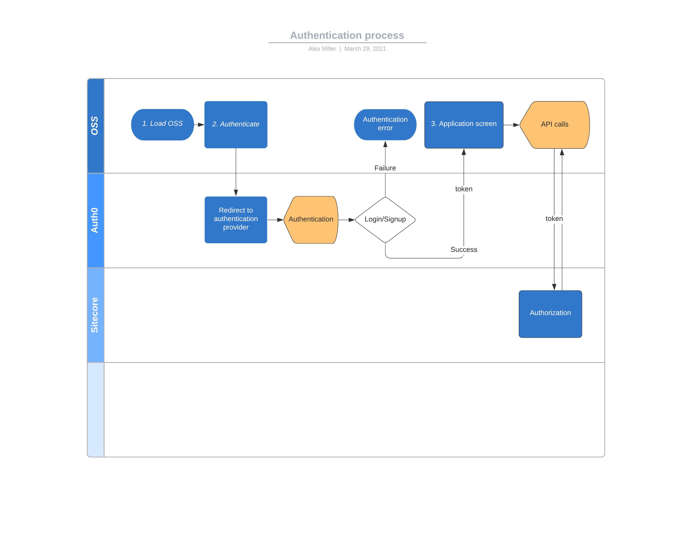

# vue-spa-netlify

## Project setup
```
yarn install
```

### Compiles and hot-reloads for development
```
yarn serve
```

### Compiles and minifies for production
```
yarn build
```

### Run your unit tests
```
yarn test:unit
```

### Lints and fixes files
```
yarn lint
```

### Customize configuration
See [Configuration Reference](https://cli.vuejs.org/config/).

## Authentication

Authentication process in handled with Auth0 and described in [examples](https://github.com/auth0-samples/auth0-vue-samples/).

### Authentication flow
